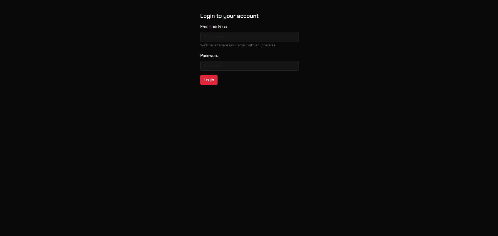
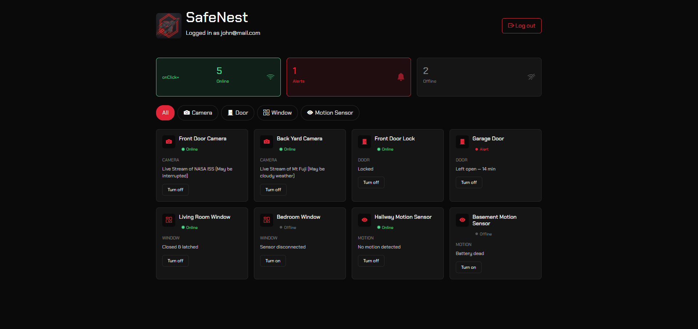
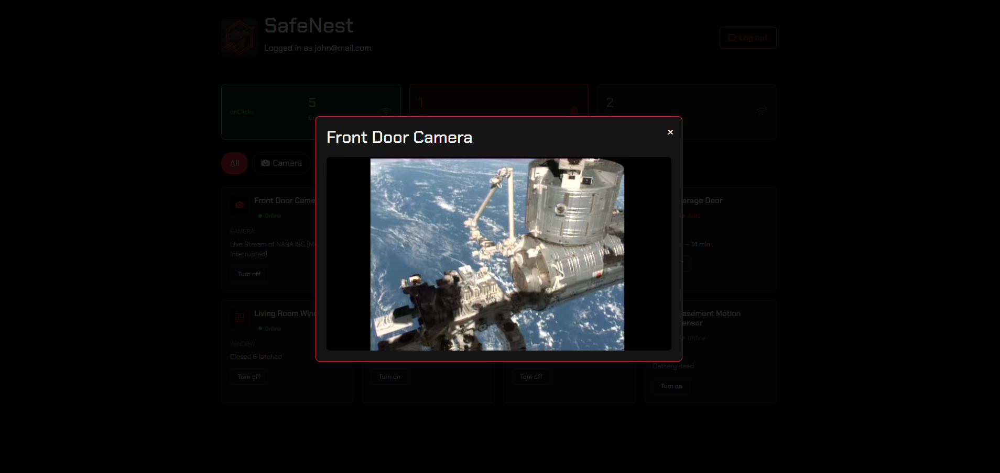

# MaveSec — Smart Home Security Dashboard

MaveSec is a React-based smart home security dashboard. Users log in to view the real-time status of home security devices and view live camera feeds.

## Login screen

## Dashboard

## Camera feed modal

## Login credentials

- Email: `john@mail.com`
- Password: `admin`

## Features

- Protected login flow using React Context for authentication state
- Persistent login across page refreshes via `localStorage`
- Route guarding — the dashboard is inaccessible unless logged in, enforced via a custom `RequireAuth` route wrapper
- Real-time device status overview (Online / Alerts / Offline counts)
- Filter devices by type (Camera, Door, Window, Motion)
- Click-to-view video modal for camera devices, with autoplaying embedded YouTube feed
- Pulsing "Online" status indicator
- Custom black-and-red theme with Chakra Petch typography
- Fully client-side routing via React Router

